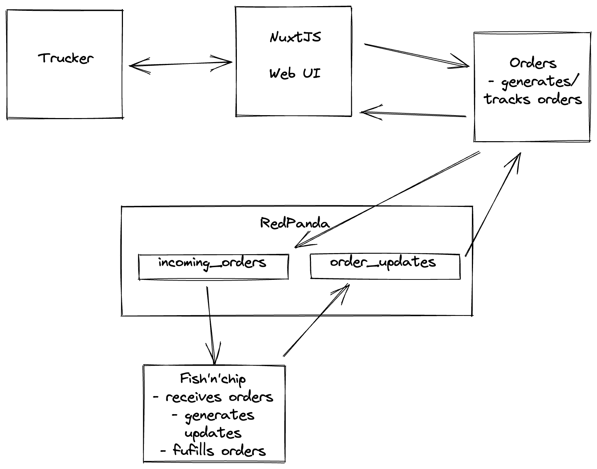

This is just an experiment to play with RedPanda, Nuxt (and a bit of partyjs?), more rust and a bit of github actions.

The goal here is to wire up some sort of fish and chip shop that can take orders of passer-bys and serve them up.

There will be a UI of some sort, I am leaning towards NuxtJS to give that a try.

The architecture will take this form:



Where we will have:
- a web ui that publishes orders
- an order backend for the front end that receives the order, munges the request and turns it into a queue item and tracks that item as it moves through various states of development
- a "ma and pa" shop app that will receive and sends out the order

The architecture may grow from here, but the important thing here is the scale at which this will operate on.

To test the consumption and sourcing of events in RedPanda and what happens if you take a particular app down.

What I want to have:
- a basic Nuxt JS framework to demonstrate to myself how Vue JS works
- a basic test pipeline that runs tests per commit and generates a docker image when merged to main

## Orders

Looking at the menu:
```
query {
    menu {
        menuItem {
            id
            name
        }
    }
}
```

The menu items can be a meal or a simple drink.

You should know the name of the item that you are ordering.

Customisations can come later.

Creating the order:
```
mutation {
    createOrder(input: OrderCreationInput!) {
        orderNumber
    }
}

input OrderCreationInput {
    orders: [Int!]!
}
```

You can create a list of orders, hence the array.

And what you get back is an order number to track how your
order is going.

It should be noted that the client manages their "cart", the
backend only handles successfully agreed upon orders.